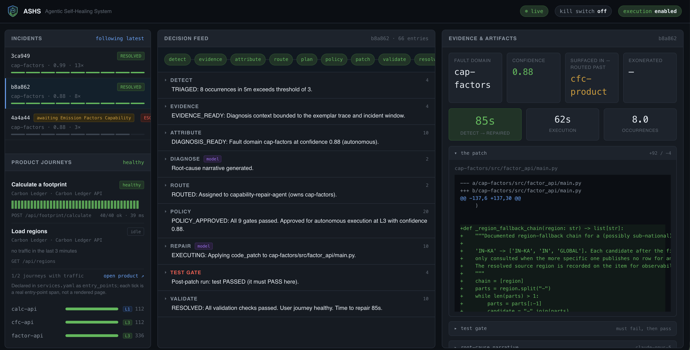

# ASHS — Agentic Self-Healing System

An agentic control plane that detects a failure in a user-facing product, works
out **who actually owns the bug** across a service boundary, repairs it in the
right place, proves the fix works, and rolls back cleanly when it doesn't.

The hard part is not writing the patch. It is knowing a real problem occurred,
attributing it to the correct owner, deciding whether an autonomous change is
safe here, verifying the fix did not create a worse one, and stopping cleanly
when the system is out of its depth. **This project treats the routing and the
guardrails as the product, and code generation as a commodity step inside it.**

---

## The one idea

> **Attribution is deterministic. Only the narrative and the patch come from a model.**

| Deterministic (code) | Model (Claude) |
|---|---|
| who owns the bug | why it happened, in prose |
| which agent may repair it | what the fix should be |
| whether it may run at all | *(nothing else)* |

A demo where a language model is asked "who broke this?" proves nothing. Here the
fault domain is decided by walking the trace and validating the payload a
capability actually returned against the schema it actually published. The model
is never consulted on ownership, routing, or policy — and the exit tests assert
that no model call appears at or before the attribution decision.

---



---

## Quick start

```bash
cp .env.example .env         # add AWS credentials (see below)
make up                      # 7 containers, healthy in ~20s
make verify                  # 45 checks across 4 phases
make demo-prep && make demo  # the 5-minute demo, two acts (runs in 1m47s)
```

| Surface | URL |
|---|---|
| **ASHS dashboard** | http://localhost:3001 ← project this |
| Carbon Ledger (the product) | http://localhost:3000 |
| Product API | http://localhost:8000 |
| Control plane | http://localhost:8090 |
| calc-api / factor-api docs | :8081/docs · :8082/docs |

---

## Credentials

Everything lives in **`./.env` at the repo root**. Compose resolves `.env`
relative to each compose file's directory, so every `make` target routes through
`--env-file .env` — otherwise a root `.env` is silently ignored, which looks
exactly like "my keys don't work".

```bash
LLM_PROVIDER=bedrock
LLM_MODEL=anthropic.claude-opus-5     # Bedrock IDs take the anthropic. prefix
AWS_REGION=eu-west-1                  # set explicitly; unset silently falls back to us-east-1
AWS_ACCESS_KEY_ID=...
AWS_SECRET_ACCESS_KEY=...
AWS_SESSION_TOKEN=...                 # only for temporary STS/SSO credentials
```

```bash
make check-bedrock     # makes one REAL call; names the failure if it fails
```

> ⚠️ **STS/SSO tokens expire in 1–12 hours.** If they lapse mid-demo you do not
> get a clean error — you get escalations that *look like the system failing to
> repair*. For a demo machine use a long-lived IAM key scoped to
> `bedrock:InvokeModel` and `bedrock:InvokeModelWithResponseStream`.

**The system runs without a model.** Attribution, policy and the test gate never
call one. With no credentials the pipeline still detects, attributes, plans and
gates — it escalates instead of patching, with the deterministic diagnosis
intact. That is the live-demo safety net.

### Bedrock API surface (probed, not assumed)

| Parameter | `eu-west-1` / `anthropic.claude-opus-5` |
|---|---|
| adaptive thinking | ✅ |
| `output_config.effort` | ✅ |
| `output_config.format` (structured outputs) | ❌ 400 |
| `tools[].strict` | ❌ 400 |
| **forced non-strict tool use** | ✅ ← how structure is obtained |

`temperature` / `top_p` / `top_k` are removed on Opus 5 and return 400. Steer
with the prompt, never with sampling parameters.

---

## Architecture

```
  browser ─▶ cfc-web ─▶ cfc-api ─▶ calc-api ─▶ factor-api ─▶ factor-db
             └─────── cfc-product ──┘   cap-calc      cap-factors
                          │
             OTel ────────┴──────▶ collector ──▶ ashs-control ──▶ ashs-db
                                                      │
                                                 ashs-ui :3001
```

One Compose project per ownership boundary, a shared `ashs-mesh` network for
cross-stack traffic, and each stack's datastore on its internal network only —
the Compose equivalent of namespace isolation, which makes the ownership
boundary enforceable rather than decorative.

### The repair loop

```
NEW → TRIAGED → EVIDENCE_READY → DIAGNOSIS_READY → ROUTED
    → PLAN_READY → POLICY_APPROVED → EXECUTING → VALIDATING → RESOLVED
                                                → ROLLBACK → ESCALATED
```

Implemented as a **reconciler**, not a one-shot pipeline: every pass drives all
non-terminal incidents forward from whatever state they are actually in, so
recovery from a partial failure is automatic.

### Attribution — five signals, combined

1. **Trace walk** — deepest *meaningful* error span (framework plumbing excluded;
   a span carrying an exception outranks a deeper one that does not).
2. **Contract validation** — *the decisive test*. Validate the payload a
   capability actually returned against its published OpenAPI schema.
   Invalid → the capability owns it. Valid but the consumer still failed → the
   consumer owns it.
3. **Deploy correlation** — which services shipped before first occurrence.
4. **Blast radius** — one consumer affected, or every consumer?
5. *(model, last — narrative only)*

```
Scenario 1:  trace_walk 0.40 + exoneration 0.15×2 + blast_radius 0.22 = 0.92
```

Routing is on confidence, never certainty: **> 0.85** act at the service's
autonomy level · **0.60–0.85** human review · **< 0.60** escalate, do not guess.

### Guardrails — enforced in code, never by prompt

| Guardrail | Where |
|---|---|
| Path allowlist | tool gateway, from `services.yaml` |
| Protected zone | emission factors, formulas, migrations, `platform/**` |
| Test gate | patch rejected unless its test **fails pre-patch, passes post-patch**; a defect that stopped reproducing closes as stale, not escalated |
| Change budget | max autonomous merges per service per day |
| Loop breaker | 2 failed attempts on a fingerprint → human |
| Fingerprint dedupe | one open repair per defect; spans predating a repair never reopen it |
| No self-modification | agents cannot touch `platform/**` |
| Kill switch | halts the entire reconciler, every pass |
| Signed audit trail | every decision, tool call, prompt and diff |

The agent has **11 typed tools** and no raw shell, `kubectl`, `eval` or
unrestricted file access. The exit tests assert those do not exist.

---

## Configuration

Two files drive the control plane; both are mounted read-only, so a rule change
is an edit and a restart, not a rebuild.

**`platform/catalog/services.yaml`** — products, services, display names,
ownership, dependency graph, `repository` (the join key to the `code.repository`
span attribute), contract URLs, operation→schema mapping, source roots, entry
points (journeys), autonomy levels, repair-agent write allowlists.

**`platform/policy/policy.yaml`** — kill switch, confidence floors, allowed and
escalate-only action types, protected paths, sensitive zones, budgets, test-gate
requirements, detection thresholds.

### Adding a service

1. Add it to `services.yaml` with `repository`, `owner`, `contract_url`,
   `source_root`, `depends_on`, `autonomy_level`.
2. Give the service the four cross-cutting requirements:
   - OpenTelemetry with `service.name`, `service.version`, `deployment.stack`
     and **`code.repository`** on every span
   - `/openapi.json` **generated from code**, never hand-maintained
   - evidence capture of raw downstream response bodies (success path too)
   - structured JSON logs carrying `trace_id` / `span_id`
3. Extend the owning repair agent's `write_paths`.

Without the first two, attribution degrades to guesswork.

---

## Make targets

```
make up / down / reset          bring up, stop, full reset (~20s)
make verify                     all 4 phase exit tests (45 checks)
make verify-phase0..3           one phase at a time
make demo-prep / demo           THE 5-MINUTE DEMO, two acts (ACT=1 or ACT=2 for one)
make clear-incidents            wipe the incident board (demo-prep now keeps it)
make demo-scenario-1            full autonomous repair, narrated (12 min)
make demo-rollback              forced validation failure → revert
make three-runs                 acceptance: 3 clean runs from reset
make check-bedrock              one real model call
make llm / tools / incidents    status inspection
make reset-source               restore agent-patched source to baseline
make restart-control            reload after a .env change
```

---

## Verification

| Phase | Checks | Proves |
|---|---|---|
| 0 — harness | 13 | one calculation → one trace across three services, contracts published, zero-state correct |
| 1 — detect & attribute | 9 | `fault_domain: cfc-product` at 0.92 with both capabilities exonerated, **no model involved** |
| 2 — plan & gate | 13 | plan reaches `POLICY_APPROVED`; 5 guardrails **proven to refuse** |
| 3 — repair & revert | 10 | repair to `RESOLVED`; forced failure rolls back **byte-for-byte** |

Plus `make three-runs`: three consecutive clean runs from full reset —
cold start ~20s, repair loop 85–95s.

---

## The demo application

**Carbon Ledger** — a household carbon footprint calculator. It exists to break
in interesting ways, but the domain is real: every emission factor is a sourced,
published value (DEFRA 2024, CEA CO₂ Baseline v20, EPA eGRID2022, Scarborough
et al. 2014, IPCC AR6). EV factors derive from each region's own grid intensity,
so an EV in France (0.011 kgCO₂e/km) and Maharashtra (0.156) differ fourteen-fold.

Three input classes are handled separately — per-period (energy, travel),
inherently annual (diet, scaled by `months/12`), and per-month (waste) —
because conflating them is how calculators end up wrong by 12×.

> **Not for reporting or disclosure use.** Indicative only. This disclaimer is
> also *why* emission factors are a protected zone: these numbers end up in
> disclosures, so a machine may flag that they look wrong but may never quietly
> change what a customer reports as their carbon output.

---

## Known gaps

Honest list — all documented, none hidden:

| Gap | Cost |
|---|---|
| `POLICY_APPROVED` reads as if a human approved it (9 deterministic gates did) | ½ day, touches all 4 test suites |
| TTD / TTDiag not recorded (only TTR and execution time) | ~1 h |
| Evidence drill-down, trace waterfall, episode replay, cost-per-incident | dashboard polish |
| Git-backed patches (currently snapshot/restore behind the same tool contract) | deferred by choice |
| **Scenario 2** autonomous merge — attribution and draft patch work; factor-api is held at L1 so a human merges | raise `autonomy_level` in `services.yaml` |
| **Scenario 3** — the system refuses to act | ~2 days |

---

## Documents

- `ASHS-FINAL-REQUIREMENTS.md` — the consolidated specification and build plan
- `DEMO-PLAYBOOK.md` — the 5-minute demo, run sheet
- `DEMO-PLAYBOOK-full.md` — the 12-minute narrated version
- `carbon-footprint-calculator-demo-requirements.md` — the app spec
- `autonomous-bugfix-agentic-pipeline.md` — the engineering argument
